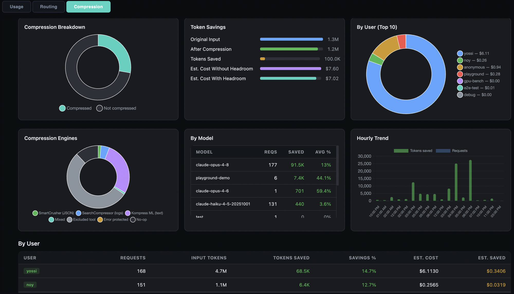

# Headroom Gateway

Centralized context compression service for enterprise LLM usage. Reduces token
costs across all users automatically — no client-side installation, no user changes.

Powered by [headroom](https://github.com/chopratejas/headroom) (Apache 2.0, 28k+ stars).



## The Problem

LLM coding agents (Claude Code, Codex, Copilot) generate massive context through
tool calls — file reads, build logs, API responses, search results. A typical
coding session reaches 150K+ tokens, of which **80% is tool output**. Every request
sends the full conversation history. Token costs scale linearly.

Most of that tool output is old, repetitive, and compressible without affecting
the model's reasoning. But compression must happen transparently — users shouldn't
have to think about it.

## How It Works

The headroom compression service integrates with the MaaS platform via a IPP plugin.
Users point at MaaS as they do today — compression is automatic.

```
Client (Claude Code / Codex / Cursor)
  │
  ▼
MaaS Gateway (Envoy + Istio)
  ├─ Kuadrant: API key validation, user identification
  ├─ IPP ext-proc (payload-processing):
  │   ├─ model-extractor: model → X-Gateway-Model-Name
  │   ├─ metering-check: balance check, user tracking
  │   ├─ model-provider-resolver: resolve ExternalModel → provider
  │   ├─ headroom plugin ──── POST /v1/compress ──▶ Headroom Service
  │   │                    ◀── compressed messages ─┘  (this repo)
  │   ├─ api-translation: passthrough
  │   └─ apikey-injection: inject provider key
  │
  ▼
Provider (api.anthropic.com / api.openai.com)
```

### How It Fits Together

This repo is one component in a larger platform. Here's what each piece does and who owns it:

| Component | Repo | What It Does | Relationship to Headroom |
|-----------|------|-------------|--------------------------|
| **MaaS Gateway** | Envoy + Istio (infra) | Routes requests, TLS termination | Headroom service sits behind it as an internal ClusterIP service |
| **Kuadrant** | kuadrant.io (operator) | API key validation, user identity, rate limiting | Identifies the user → `x-maas-username` header flows to headroom for per-user stats |
| **IPP / payload-processing** | [ai-gateway-payload-processing](https://github.com/opendatahub-io/ai-gateway-payload-processing) | Plugin chain for request/response processing (ext-proc) | The **headroom plugin** lives here — it calls our service at `POST /v1/compress` |
| **Headroom plugin** (Go) | [yossiovadia/ai-gateway-payload-processing](https://github.com/yossiovadia/ai-gateway-payload-processing) branch `feat/headroom-on-metering` | Sends messages to headroom service, replaces with compressed versions | 3 files, 15 tests. Reads username from CycleState (set by metering plugin) |
| **Headroom service** (Python) | **This repo** | Compression engine — wraps headroom's `compress()` with stats, persistence, pricing | Standalone deployment. Only dependency: metering Postgres for per-model pricing |
| **Metering service** | [noyitz/ai-gateway-metering-service](https://github.com/noyitz/ai-gateway-metering-service) | Token usage tracking, per-user billing, model pricing DB | Headroom reads `model_pricing` table for cost calculations. Compression tab embedded via iframe |
| **MaaS controller** | [models-as-a-service](https://github.com/opendatahub-io/models-as-a-service) | Generates AuthPolicy, ExternalModel CRDs, manages API keys | Configures the auth pipeline that identifies users. Not running on dogfood cluster — patched manually |
| **IPP config** (ConfigMap) | Deployed on cluster | Defines the plugin chain order | Headroom must be listed after `model-provider-resolver` and before `api-translation` |

**Build independence:** This repo (headroom service + dashboard) deploys independently — no IPP rebuild needed. The Go plugin is part of the payload-processing image build. The only shared contract is `POST /v1/compress` with `{messages, model}` → `{messages, tokens_before, tokens_after, tokens_saved, compression_ratio}`.

**Zero user changes.** Same MaaS URL, same API key:

```bash
export ANTHROPIC_BASE_URL=https://maas.company.com/llm/ext-opus
export ANTHROPIC_API_KEY=<MaaS-key>
claude --model claude-opus-4-8
```

## Compression Results

From production deployment on OpenShift:

| Content Type | Savings | Engine |
|---|---|---|
| Kubernetes API responses (JSON) | **60-74%** | SmartCrusher |
| Build/test logs | **65-80%** | LogCompressor / SearchCompressor |
| Search/grep results | **70-80%** | SearchCompressor |
| Free text / documentation | **10-35%** | Kompress ML |
| Git diffs | **40-60%** | DiffCompressor |
| Code editing sessions (mixed) | **5-15%** | Kompress ML (most content is excluded — see below) |

## Compression Engines

Headroom's `ContentRouter` auto-detects content type and routes to the best compressor:

| Engine | Active | What It Does | Typical Savings |
|--------|--------|-------------|-----------------|
| **SmartCrusher** | YES | Compresses JSON arrays — deduplicates structure, keeps important items and anomalies. Rust-backed via PyO3. | 60-74% |
| **Kompress ML** | YES | Custom ML model (ModernBERT tokenizer + ONNX) trained on AI agent traces. Scores token importance, removes low-value tokens. | 10-35% |
| **SearchCompressor** | YES | Compresses grep/ripgrep results — keeps matching lines, deduplicates context. | 70-80% |
| **LogCompressor** | YES | Compresses build logs and test output — keeps errors/failures, deduplicates repetitive lines. | 65-80% |
| **DiffCompressor** | YES | Compresses git diffs — keeps hunks, deduplicates similar changes. | 40-60% |
| **HTMLExtractor** | YES | Extracts meaningful text from HTML, strips tags and boilerplate. | varies |
| **CodeAwareCompressor** | NO | AST-based code compression (Python, JS, Go, Rust, Java, C++). Disabled by default upstream — headroom recommends code graph MCP tools instead. | 30-50% |
| **ImageCompressor** | N/A | ML router for image size reduction. Not applicable in our text-only pipeline. | 40-90% |

### When Each Engine Fires

The `ContentRouter` selects an engine based on the shape of the content, not its meaning:

| Engine | Triggers When | Examples |
|--------|--------------|----------|
| **SmartCrusher** | Content starts with `[` (JSON array) or is a JSON object containing arrays | `kubectl get pods -o json`, `pip list --format=json`, any API returning a list of items |
| **LogCompressor** | Lines start with timestamp patterns (`2026-06-24T...`, `[INFO]`, `[ERROR]`) — structured, repetitive | `docker build` output, `pytest -v` with PASSED/FAILED lines, application logs |
| **SearchCompressor** | Content looks like grep/ripgrep results with file paths, line numbers, and match context | `grep -rn "pattern" .`, `rg "pattern"`, search result outputs |
| **DiffCompressor** | Content matches unified diff format (`---`, `+++`, `@@`, `+`/`-` prefixed lines) | `git diff`, `git show`, patch files |
| **HTMLExtractor** | Content contains HTML tags (`<html>`, `<div>`, `<p>`) | Web scraping results, API responses with HTML bodies |
| **Kompress ML** | Fallback — fires when nothing above matches. Any free-form text. | Documentation, meeting notes, prose, descriptions |
| **None (skipped)** | Content is from an excluded tool (Read, Write, Edit), is a user/system message, is an error with stack traces, or is below 500 tokens | File reads, code edits, short responses, error tracebacks |

### Content Protection

Not everything gets compressed. Headroom protects content that must remain exact:

| Content | Action | Reason |
|---------|--------|--------|
| User messages | Protected | Model needs exact user input |
| System prompts | Protected | Cache-hot instruction bytes |
| Read tool outputs (fresh) | Excluded | Exact file content needed for code editing |
| Write/Edit tool outputs | Excluded | Mutation records must be exact to prevent duplicate edits |
| Error outputs | Protected | Tracebacks and stack traces preserved verbatim for debugging |
| Recent tool outputs | Protected | Last N turns kept verbatim |
| Stale Read outputs | Compressed | File was edited after reading — content is factually wrong |
| Superseded Read outputs | Compressed | File was re-read later — content is redundant |

### Why Code Editing Sessions Show Lower Savings

Coding sessions are dominated by Read/Edit tool outputs which headroom deliberately
excludes. Without retrieval support (CCR), compressing a file read would mean the LLM
works from a summary instead of exact code — risking wrong edits. Headroom's
ReadLifecycle catches stale reads (67% of all reads) and superseded reads (12%),
but fresh reads (20%) stay verbatim. DevOps/debugging sessions with logs, JSON, and
command output see much higher savings (40-70%).

## Features

- **Per-user session cache** — avoids re-compressing content seen in earlier requests (same user, same session)
- **Per-model pricing** — real costs from metering Postgres, not hardcoded estimates
- **Durable savings tracking** — `proxy_savings.json` on PVC, lifetime stats survive restarts
- **CCR (Compress-Cache-Retrieve)** — originals stored on PVC, LLM can retrieve via `headroom_retrieve` tool
- **Image compression** — optional, reduces image token cost by 40-90%
- **GPU acceleration** — onnxruntime-gpu auto-detects NVIDIA GPUs, falls back to CPU
- **Built-in dashboard** — `/dashboard` with compression stats, cache hits, agent usage, savings breakdown
- **Playground + CCR demo** — interactive compression demo with retrieval visualization
- **Prometheus metrics** — `/metrics` endpoint

## Deployment

### Prerequisites (not ours — must exist first)

These are deployed by the MaaS platform team before headroom:

| # | Component | Purpose | How to verify |
|---|-----------|---------|---------------|
| 1 | **OpenShift cluster** | Infrastructure | `oc whoami` succeeds |
| 2 | **Istio / Envoy gateway** | Traffic routing, TLS | Gateway pods running |
| 3 | **Kuadrant** | API key validation, auth | `oc get authpolicy -A` returns policies |
| 4 | **MaaS controller + maas-api** | API key management, user identity | `oc get pods -n opendatahub` shows maas-api |
| 5 | **IPP / payload-processing** | Plugin chain (metering, api-translation, apikey-injection) | `oc get deployment payload-processing -n openshift-ingress` |
| 6 | **Metering service + Postgres** | Usage tracking, model pricing | `oc get statefulset metering-postgresql -n openshift-ingress` |

**Headroom does NOT require any IPP plugin or ConfigMap changes.** It sits before
MaaS as a transparent proxy. The IPP pipeline runs after MaaS as usual.

### Deploy headroom proxy

```bash
# 1. Clone this repo
git clone https://github.com/yossiovadia/headroom-gateway.git
cd headroom-gateway

# 2. Deploy (one command)
./scripts/deploy-proxy.sh --hf-token hf_xxx

# Optional: custom MaaS URL
./scripts/deploy-proxy.sh --maas-url https://maas.company.com/llm/ext-opus
```

The script:
1. Builds the headroom proxy image on-cluster (CUDA base + headroom-ai + models)
2. Creates a PVC for persistent stats and CCR store
3. Deploys the proxy with correct env vars
4. Creates a Service + Route
5. Runs a smoke test

### What gets deployed

```
headroom-proxy (Deployment)
  ├── image: headroom proxy with GPU + image support
  ├── port: 8787
  ├── env: ANTHROPIC_TARGET_API_URL → MaaS gateway
  └── volume: PVC at /opt/app/.headroom (savings + CCR store)

headroom-proxy (Service)
  └── ClusterIP port 8787

headroom-proxy (Route)
  └── TLS edge → https://headroom-proxy-<namespace>.apps.<cluster>
```

No dashboard pod needed — the proxy serves `/dashboard` built-in.

### Point users at headroom

```bash
# Users set ONE env var (instead of pointing at MaaS directly)
export ANTHROPIC_BASE_URL="https://headroom-proxy-<namespace>.apps.<cluster>"
export ANTHROPIC_API_KEY="<MaaS-API-key>"       # same key as before
claude --model claude-opus-4-8                    # works normally
```

### GPU Support

GPU is auto-detected at runtime. No flags needed.

| Resource | CPU-only | With GPU |
|----------|----------|----------|
| Kompress ML latency | ~3s | <100ms |
| Concurrent users | ~50 | ~200+ |
| GPU required | — | 1x NVIDIA L4/T4 |
| Memory | 4-8Gi | 4-8Gi |

### Emergency Controls

**Rollback** — users change one env var to bypass headroom entirely:
```bash
export ANTHROPIC_BASE_URL="https://maas.company.com/llm/ext-opus"  # direct to MaaS
```
No deployment changes needed. Compression stops, everything else works.

**Scale to zero** — stop headroom without affecting MaaS:
```bash
oc scale deployment/headroom-proxy --replicas=0
```

## API Endpoints

| Endpoint | Method | Purpose |
|----------|--------|---------|
| `/v1/compress` | POST | Compress messages (IPP plugin calls this) |
| `/stats` | GET | Stats for dashboard (aggregates, per-user, recent) |
| `/stats/insights` | GET | Engine breakdown, by-model, hourly trends |
| `/stats-history` | GET | Lifetime stats with history |
| `/pricing` | GET | Per-model pricing from metering Postgres |
| `/sessions` | GET | Active user sessions and cache hit rates |
| `/readyz` | GET | Readiness probe (checks SQLite) |
| `/health` | GET | Liveness probe |
| `/metrics` | GET | Prometheus counters |

## Testing

37 tests run against the live deployed service:

```bash
# Fast tests (compression, stats, health, dashboard)
HEADROOM_TEST_URL=https://headroom-service-... pytest tests/ -v

# Including persistence tests (restarts pod, ~60s)
HEADROOM_TEST_URL=https://headroom-service-... pytest tests/ -v --run-slow

# Benchmark compression latency
./scripts/benchmark-compression.sh --requests 10
```

## Project Structure

```
headroom-gateway/
├── service/
│   ├── headroom_service.py     # FastAPI compression service
│   └── Dockerfile              # CUDA + headroom-ai + onnxruntime-gpu
├── dashboard/
│   └── index.html              # Dashboard + Playground (stats, per-user, pipeline viz)
├── scripts/
│   ├── deploy-headroom.sh      # Idempotent OpenShift deployment
│   ├── benchmark-compression.sh # Latency benchmark
│   └── ab-cache-test.py        # A/B cache hit comparison
├── tests/
│   ├── test_compress.py        # 14 compression tests
│   ├── test_stats.py           # 9 stats tests
│   ├── test_dashboard.py       # 7 dashboard contract tests
│   ├── test_health.py          # 5 health/metrics tests
│   └── test_persistence.py     # 2 persistence tests (pod restart)
├── docs/
│   └── architecture.md         # Full design doc with gap analysis
├── LICENSE                     # Apache 2.0
└── NOTICE                      # Third-party attributions
```

## Related Repos

| Repo | Purpose |
|------|---------|
| [headroom](https://github.com/chopratejas/headroom) | Upstream compression library (Apache 2.0) |
| [ai-gateway-payload-processing](https://github.com/yossiovadia/ai-gateway-payload-processing) branch `feat/headroom-on-metering` | IPP Go plugin |
| [ai-gateway-metering-service](https://github.com/noyitz/ai-gateway-metering-service) | MaaS dashboard (compression tab embedded) |
